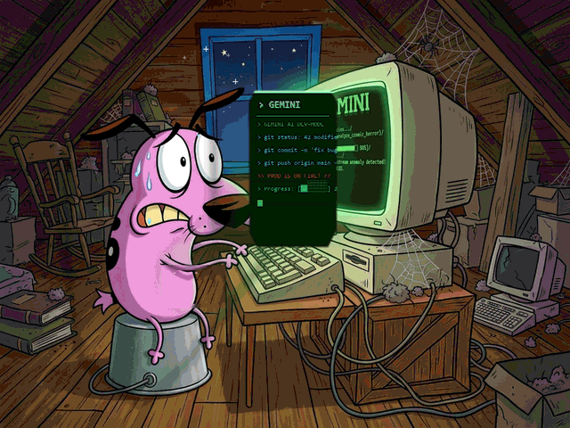

  
  
  # Olá, eu sou o Denner Alves! 👋
  
<i>Iniciante em Tecnologia | Estudante de Fundamentos & IA | Aprendiz na DIO.me</i>

  

    
    
  

---

### 👨‍💻 Sobre Mim & Momento de Aprendizado

- 📚 **Iniciante em Tecnologia:** Estou no início da minha jornada, construindo uma base sólida em programação e explorando o potencial da Inteligência Artificial.
- 🎯 **Foco em Fundamentos:** Atualmente focado em entender a **lógica por trás da programação** e os conceitos essenciais do desenvolvimento.
- 💡 **Transparência:** Todo o meu conhecimento atual é fruto de **estudos teóricos e desafios básicos para iniciantes**, sem experiência prática profissional prévia na área.
- 🎓 **Plataforma de Estudos:** Minha principal fonte de aprendizado é a **DIO.me**, onde realizo cursos e bootcamps com o apoio de ferramentas de IA (**Gemini** e **ChatGPT**) como tutores de estudo.

---

### 🛠️ Tecnologias & Conceitos em Estudo Básico

> *Nota: Tecnologias e tópicos que estou aprendendo e praticando em nível introdutório através de cursos e exercícios.*

#### 🤖 Inteligência Artificial & Ferramentas de Apoio

#### 💻 Fundamentos de Programação & Sistemas

#### ⚙️ Controle de Versão & Organização

---

### 💬 Onde me encontrar

- 🌐 **GitHub:** [allvv7](https://github.com/allvv7)
